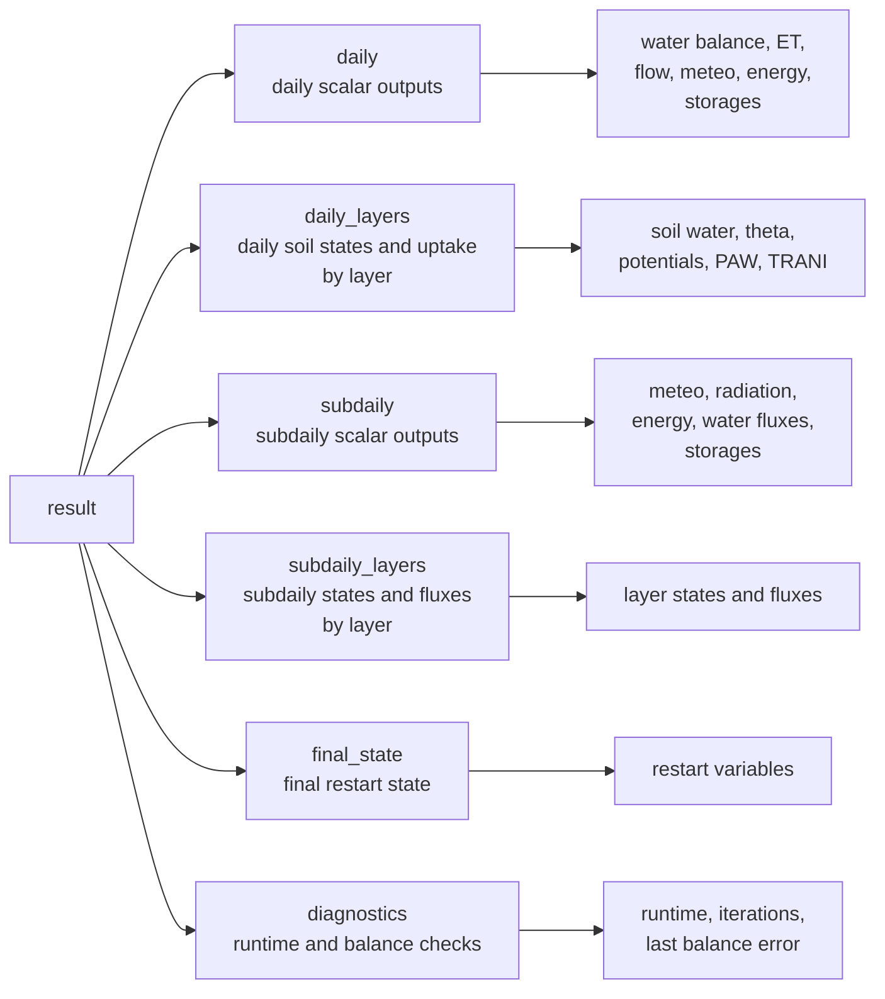

# Subdaily_BROOK90

Modification of the R version of Federer’s BROOK90 model to simulate subdaily water, energy, and soil-water dynamics at a single site.

[]()
[](https://github.com/hydrovorobey/Subdaily_BROOK90/releases/latest)

**Current code version:** `v1.3`  
**Release/update:** Windows update, 05/2026  
**Latest release:** https://github.com/hydrovorobey/Subdaily_BROOK90/releases/latest

## Licence

Attribution-NonCommercial-NoDerivatives 4.0 International (CC BY-NC-ND 4.0)

## Main reference

Kronenberg, R., Vorobevskii, I., Luong, T. T., Spank, U., Kim, D., and Mauder, M.  
*An extension of the BROOK90 hydrological model for estimation of subdaily water and energy fluxes.*  
EGUsphere / GMD preprint, 2025.  
https://doi.org/10.5194/egusphere-2025-2084

## Model features

- Subdaily simulation and output, tested with 30-min forcing data.
- Flexible temporal resolution; shorter timesteps are possible if forcing data are available.
- Coupled water and energy balance at the atmosphere–plant–soil interface.
- Estimation of latent heat flux, sensible heat flux, evapotranspiration, soil-water dynamics, runoff components, and groundwater discharge.
- Daily and subdaily outputs are written into one structured `result` object.

---

## Model input

The current subdaily version uses **one subdaily forcing file**. Daily forcing diagnostics such as daily precipitation, daily solar radiation, daily maximum temperature, and daily minimum temperature are derived internally from the subdaily data.

The forcing file must contain the following columns:

| Column name | Unit expected by model | Meaning |
|---|---:|---|
| `YY` | year | Year. |
| `MM` | month | Month. |
| `DD` | day | Day of month. |
| `HH` | hour | Hour of day; for 30-min data, the same hour can occur twice. |
| `precipitation_mm` | mm timestep⁻¹ | Precipitation amount accumulated over the timestep. |
| `air_temperature_C` | °C | Air temperature. |
| `solar_radiation_Wm2` | W m⁻² | Mean incoming shortwave radiation flux density during the timestep. |
| `wind_speed_ms` | m s⁻¹ | Wind speed. |
| `vapor_pressure_kPa` | kPa | Actual vapour pressure. |
| `soil_heat_flux_Wm2` | W m⁻² | Mean soil heat flux density during the timestep. |

---

## Model files

The model repository contains:

- the BROOK90 physical lumped water-balance model with subdaily water and energy flux extensions;
- a standard parameter file with default model parameters;
- site-specific parameter files that overwrite the standard parameters;
- sample forcing data and parameter sets for ICOS sites in Saxony, Germany.

Example sites:

- **DE-Tha** – mature spruce forest;
- **DE-Hzd** – young oak forest;
- **DE-Gri** – grassland;
- **DE-Kli** – cropland.

---

## Running the model

The model is executed from `RUN_MODEL.R`.

```r
scriptpath <- ".../v_1.3_22052026/"
model_file   <- paste0(scriptpath, "B90_subdaily_v1.3.R")
std_pars     <- paste0(scriptpath, "standard_model_parameters.R")
site_pars    <- paste0(scriptpath, "data/site_pars.R")
forcing_file <- paste0(scriptpath, "data/site_meteo.csv")
OBSINT <- 30 * 60   # observation interval, seconds
NPINT  <- 48        # number of subdaily intervals per day
brook90.environment <- new.env(parent = globalenv())
source(model_file, local = brook90.environment)
source(std_pars,   local = brook90.environment)
source(site_pars,  local = brook90.environment)
subdailyfile <- read.csv(
  forcing_file,
  header = TRUE,
  sep = ";",
  stringsAsFactors = FALSE
)
brook90.environment$subdailyfile <- subdailyfile
brook90.environment$OBSINT <- OBSINT
brook90.environment$NPINT  <- NPINT

result <- brook90.environment$execute(verbose = TRUE)

```

---

## Horizontal process scheme

```mermaid
flowchart LR
  F["Subdaily forcing<br/>P, TA, SW, wind, vapour pressure, soil heat flux"]
  D["Daily diagnostics<br/>prepare_daily_forcing()"]
  R["Current timestep<br/>read_forcing()"]
  C["Canopy, roughness,<br/>radiation, snow setup<br/>MSBSETVARSsub()"]
  E["Energy balance and ET<br/>MSBDAYNIGHTsub()"]
  I["Interception,<br/>rain/snow, snowpack<br/>MSBPREINTsub()"]
  S["Soil-water iteration<br/>MSBITERATE()"]
  W["Water fluxes<br/>vertical, lateral, bypass,<br/>root uptake, GW"]
  U["State update<br/>soil, snow, interception,<br/>groundwater"]
  O["Aggregation<br/>paccum(), psum(),<br/>daccum_subdaily(), dsum()"]
  X["Output result<br/>daily, daily_layers,<br/>subdaily, subdaily_layers,<br/>final_state, diagnostics"]

  F --> D --> C
  F --> R --> C
  C --> E --> I --> S --> W --> U --> O --> X
```



### Process blocks

| Block | Functions | Main role |
|---|---|---|
| Forcing | `prepare_daily_forcing()`, `read_forcing()` | Read subdaily forcing and derive daily diagnostics. |
| Canopy / radiation | `CANOPY()`, `ROUGH()`, `SUNDSsub()`, `AVAILEN()`, `MSBSETVARSsub()` | Update vegetation, roughness, radiation, available energy, snow setup. |
| ET / energy | `SWGRA()`, `SRSC()`, `SWPE_subdaily()`, `SWGE_subdaily()`, `TBYLAYERsub()`, `MSBDAYNIGHTsub()` | Calculate resistances, potential ET, actual ET, latent heat, and sensible heat. |
| Interception / snow | `INTER_subdaily()`, `SNOWPACK()`, `SNOVAP()`, `MSBPREINTsub()` | Partition precipitation and update interception and snowpack. |
| Soil / groundwater | `MSBITERATE()`, `VERT()`, `INFLOW()`, `BYFLFR()`, `DSLOP()`, `GWATER()` | Calculate vertical, lateral, bypass, groundwater, and seepage fluxes. |
| Output | `paccum()`, `psum()`, `daccum_subdaily()`, `dsum()`, `save_*_output()` | Aggregate timestep and daily fluxes and save output objects. |

---

## Horizontal output scheme



---

# Complete output-variable description

The model returns one structured R object:

```r
result
```

with six main elements:

| Object | Content |
|---|---|
| `result$daily` | Daily scalar outputs, one row per day. |
| `result$daily_layers` | Daily layer-wise soil states and transpiration uptake, rows = days and columns = soil layers. |
| `result$subdaily` | Subdaily scalar outputs, one row per timestep. |
| `result$subdaily_layers` | Subdaily layer-wise states and fluxes, rows = timesteps and columns = soil layers. |
| `result$final_state` | Final model state at the end of the run. |
| `result$diagnostics` | Runtime and numerical diagnostics. |

## `result$daily`

Daily scalar outputs; one row per day.

| Variable | Unit | Description |
|---|---:|---|
| `DATE` | date | Calendar date. |
| `YY` | year | Year. |
| `MM` | month | Month. |
| `DD` | day | Day of month. |
| `DOY` | day | Day of year. |
| `forcing_precipitation_mm` | mm d⁻¹ | Daily precipitation sum from forcing before optional model correction. |
| `forcing_solar_radiation_MJm2` | MJ m⁻² d⁻¹ | Daily incoming shortwave radiation sum derived from subdaily W m⁻². |
| `forcing_TMAX_C` | °C | Daily maximum air temperature from subdaily forcing. |
| `forcing_TMIN_C` | °C | Daily minimum air temperature from subdaily forcing. |
| `PRECD_mm` | mm d⁻¹ | Model precipitation after optional correction. |
| `EVAPD_mm` | mm d⁻¹ | Total actual evapotranspiration. |
| `FLOWD_mm` | mm d⁻¹ | Total streamflow / runoff output. |
| `SEEPD_mm` | mm d⁻¹ | Deep seepage loss. |
| `BALERD_mm` | mm d⁻¹ | Daily water-balance error; should be near zero. |
| `RFALD_mm` | mm d⁻¹ | Rainfall. |
| `SFALD_mm` | mm d⁻¹ | Snowfall. |
| `RINTD_mm` | mm d⁻¹ | Rain intercepted by canopy. |
| `SINTD_mm` | mm d⁻¹ | Snow intercepted by canopy. |
| `RTHRD_mm` | mm d⁻¹ | Rain throughfall. |
| `STHRD_mm` | mm d⁻¹ | Snow throughfall. |
| `RNETD_mm` | mm d⁻¹ | Net rain reaching ground / snow system after snowpack transfer. |
| `RSNOD_mm` | mm d⁻¹ | Rain transferred to snowpack. |
| `SMLTD_mm` | mm d⁻¹ | Snowmelt drainage. |
| `IRVPD_mm` | mm d⁻¹ | Evaporation from intercepted rain. |
| `ISVPD_mm` | mm d⁻¹ | Evaporation / sublimation from intercepted snow. |
| `SNVPD_mm` | mm d⁻¹ | Snowpack evaporation / sublimation. |
| `SLVPD_mm` | mm d⁻¹ | Soil evaporation. |
| `TRAND_mm` | mm d⁻¹ | Actual transpiration. |
| `PTRAND_mm` | mm d⁻¹ | Potential transpiration. |
| `SLFLD_mm` | mm d⁻¹ | Soil-surface water input. |
| `SRFLD_mm` | mm d⁻¹ | Surface runoff / source-area runoff. |
| `BYFLD_mm` | mm d⁻¹ | Bypass flow. |
| `INFLD_mm` | mm d⁻¹ | Infiltration into soil layers. |
| `DSFLD_mm` | mm d⁻¹ | Downslope / lateral soil-water flow. |
| `GWFLD_mm` | mm d⁻¹ | Groundwater discharge to streamflow. |
| `TA_C_mean` | °C | Daily mean air temperature. |
| `EA_kPa_mean` | kPa | Daily mean actual vapour pressure. |
| `VPD_kPa_mean` | kPa | Daily mean vapour-pressure deficit. |
| `SWJINT_Wm2_mean` | W m⁻² | Daily mean incoming shortwave radiation. |
| `SHEAT_Wm2_mean` | W m⁻² | Daily mean soil heat flux. |
| `SLRAD_Wm2_mean` | W m⁻² | Daily mean slope-corrected shortwave radiation. |
| `AA_Wm2_mean` | W m⁻² | Daily mean available energy at canopy/reference level. |
| `ASUBS_Wm2_mean` | W m⁻² | Daily mean available energy at soil/snow surface. |
| `SOLNET_Wm2_mean` | W m⁻² | Daily mean net shortwave radiation. |
| `LNGNET_Wm2_mean` | W m⁻² | Daily mean net longwave radiation. |
| `LE_Wm2_mean` | W m⁻² | Daily mean final total latent heat flux. |
| `LE.PRA_Wm2_mean` | W m⁻² | Daily mean effective latent heat component of actual transpiration. |
| `LE.PRA.pot_Wm2_mean` | W m⁻² | Daily mean latent heat equivalent of potential transpiration; not part of total LE. |
| `LE.ERA_Wm2_mean` | W m⁻² | Daily mean effective latent heat component of soil evaporation. |
| `LE.IR_Wm2_mean` | W m⁻² | Daily mean latent heat flux from intercepted rain evaporation. |
| `LE.IS_Wm2_mean` | W m⁻² | Daily mean latent heat flux from intercepted snow evaporation/sublimation. |
| `LE.SNO_Wm2_mean` | W m⁻² | Daily mean latent heat flux from snowpack evaporation/sublimation. |
| `H_Wm2_mean` | W m⁻² | Daily mean final total sensible heat flux. |
| `RAA_sm_mean` | s m⁻¹ | Daily mean aerodynamic resistance between canopy source height and reference height. |
| `RAC_sm_mean` | s m⁻¹ | Daily mean canopy boundary-layer resistance. |
| `RAS_sm_mean` | s m⁻¹ | Daily mean soil/snow aerodynamic resistance. |
| `RSC_sm_mean` | s m⁻¹ | Daily mean canopy/stomatal resistance. |
| `RSS_sm_mean` | s m⁻¹ | Daily mean soil-surface resistance. |
| `INTR_mm` | mm | End-of-day intercepted rain storage. |
| `INTS_mm` | mm | End-of-day intercepted snow storage. |
| `SNOW_mm` | mm | End-of-day snow water equivalent. |
| `SNOWLQ_mm` | mm | End-of-day liquid water in snowpack. |
| `CC_MJm2` | MJ m⁻² | End-of-day snowpack cold content. |
| `SWAT_mm` | mm | End-of-day total soil-water storage. |
| `GWAT_mm` | mm | End-of-day groundwater storage. |
| `theta_profile_bulk_m3m3` | m³ m⁻³ | Profile mean bulk volumetric soil-water content. |
| `theta_profile_matrix_m3m3` | m³ m⁻³ | Profile mean stone-free / matrix volumetric water content. |
| `plant_available_water_profile_rel` | - | Profile mean relative plant-available water. |
| `NITSD` | count | Number of internal soil-water iterations during the day. |

The exported latent heat components are effective/additive, so except for small numerical rounding:

```r
LE_Wm2_mean ≈ mean(LE.PRA + LE.ERA + LE.IR + LE.IS + LE.SNO)
```

`LE.PRA.pot_Wm2_mean` is a potential-flux diagnostic and is not included in total `LE_Wm2_mean`.

## `result$daily_layers`

Daily layer-wise soil states and transpiration uptake; rows = days, columns = soil layers.

| Variable | Unit | Description |
|---|---:|---|
| `SWATI_mm` | mm | End-of-day soil-water storage per layer. |
| `theta_matrix_m3m3` | m³ m⁻³ | End-of-day stone-free / matrix volumetric water content per layer. |
| `theta_bulk_m3m3` | m³ m⁻³ | End-of-day bulk volumetric water content per layer. |
| `WETNES` | - | End-of-day wetness per layer as fraction of saturation. |
| `PSIM_kPa` | kPa | End-of-day matric soil-water potential per layer. |
| `PSITI_kPa` | kPa | End-of-day total soil-water potential per layer. |
| `plant_available_water_rel` | - | End-of-day relative plant-available water per layer. |
| `TRANI_mm` | mm d⁻¹ | Daily transpiration extracted from each soil layer. |

## `result$subdaily`

Subdaily scalar outputs; one row per forcing timestep.

| Variable | Unit | Description |
|---|---:|---|
| `DATE` | date | Calendar date. |
| `YY` | year | Year. |
| `MM` | month | Month. |
| `DD` | day | Day of month. |
| `HH` | hour | Hour value from forcing; row order defines sub-hourly sequence. |
| `ISVP` | mm timestep⁻¹ | Evaporation / sublimation from intercepted snow. |
| `IRVP` | mm timestep⁻¹ | Evaporation from intercepted rain. |
| `SNVP` | mm timestep⁻¹ | Snowpack evaporation / sublimation. |
| `SLVP` | mm timestep⁻¹ | Soil evaporation. |
| `PTRAN` | mm timestep⁻¹ | Potential transpiration. |
| `TRAND` | mm timestep⁻¹ | Actual transpiration. |
| `EVAP` | mm timestep⁻¹ | Total actual evapotranspiration. |
| `TA` | °C | Air temperature. |
| `EA` | kPa | Actual vapour pressure. |
| `ES` | kPa | Saturation vapour pressure. |
| `VPD` | kPa | Vapour-pressure deficit. |
| `DELTA` | kPa K⁻¹ | Slope of saturation vapour-pressure curve. |
| `PREINT` | mm d⁻¹ | Precipitation input rate used internally. |
| `SWJINT` | W m⁻² | Incoming shortwave radiation from forcing. |
| `SHEAT` | W m⁻² | Soil heat flux. |
| `I0HDAY` | MJ m⁻² timestep⁻¹ | Potential horizontal radiation for timestep. |
| `SOLRADC` | W m⁻² | Incoming shortwave radiation used by model. |
| `SLRAD` | W m⁻² | Slope-corrected shortwave radiation. |
| `AA` | W m⁻² | Available energy at canopy/reference level. |
| `ASUBS` | W m⁻² | Available energy at soil/snow surface. |
| `SOLNET` | W m⁻² | Net shortwave radiation. |
| `LNGNET` | W m⁻² | Net longwave radiation. |
| `RAA` | s m⁻¹ | Aerodynamic resistance between canopy source height and reference height. |
| `RAC` | s m⁻¹ | Canopy boundary-layer resistance. |
| `RAS` | s m⁻¹ | Soil/snow aerodynamic resistance. |
| `RSC` | s m⁻¹ | Canopy/stomatal resistance. |
| `RSS` | s m⁻¹ | Soil-surface resistance. |
| `LE` | W m⁻² | Final total latent heat flux. |
| `H` | W m⁻² | Final total sensible heat flux. |
| `LE.PRA` | W m⁻² | Effective latent heat component of actual transpiration. |
| `LE.PRA.pot` | W m⁻² | Latent heat equivalent of potential transpiration; not part of total LE. |
| `LE.ERA` | W m⁻² | Effective latent heat component of soil evaporation. |
| `LE.SNO` | W m⁻² | Latent heat flux from actual snowpack evaporation/sublimation. |
| `LE.IR` | W m⁻² | Latent heat flux from actual intercepted rain evaporation. |
| `LE.IS` | W m⁻² | Latent heat flux from actual intercepted snow evaporation/sublimation. |
| `RFAL` | mm timestep⁻¹ | Rainfall. |
| `SFAL` | mm timestep⁻¹ | Snowfall. |
| `RINT` | mm timestep⁻¹ | Rain intercepted by canopy. |
| `SINT` | mm timestep⁻¹ | Snow intercepted by canopy. |
| `RTHR` | mm timestep⁻¹ | Rain throughfall. |
| `STHR` | mm timestep⁻¹ | Snow throughfall. |
| `RSNO` | mm timestep⁻¹ | Rain transferred to snowpack. |
| `SMLT` | mm timestep⁻¹ | Snowmelt drainage. |
| `RNET` | mm timestep⁻¹ | Net rain reaching ground / snow system. |
| `SLFL` | mm timestep⁻¹ | Soil-surface water input. |
| `SRFL` | mm timestep⁻¹ | Surface runoff / source-area runoff. |
| `FLOWP` | mm timestep⁻¹ | Total timestep flow output. |
| `BYFLP` | mm timestep⁻¹ | Total timestep bypass flow. |
| `INFLP` | mm timestep⁻¹ | Total timestep infiltration into soil layers. |
| `DSFLP` | mm timestep⁻¹ | Total timestep downslope flow. |
| `GWFL` | mm timestep⁻¹ | Groundwater discharge. |
| `SEEP` | mm timestep⁻¹ | Deep seepage loss. |
| `INTR` | mm | Intercepted rain storage after timestep. |
| `INTS` | mm | Intercepted snow storage after timestep. |
| `SNOW` | mm | Snow water equivalent after timestep. |
| `SNOWLQ` | mm | Liquid water in snowpack after timestep. |
| `CC` | MJ m⁻² | Snowpack cold content after timestep. |
| `SWAT` | mm | Total soil-water storage after timestep. |
| `GWAT` | mm | Groundwater storage after timestep. |

The exported subdaily latent heat components are effective/additive:

```r
LE = LE.PRA + LE.ERA + LE.IR + LE.IS + LE.SNO
```

`LE.PRA.pot` is a potential-flux diagnostic and is not included in total `LE`.

## `result$subdaily_layers`

Subdaily layer-wise states and fluxes; rows = timesteps, columns = soil layers.

| Variable | Unit | Description |
|---|---:|---|
| `swati` | mm | Soil-water storage per layer. |
| `theta` | m³ m⁻³ | Stone-free / matrix volumetric water content per layer. |
| `wetnes` | - | Wetness per layer as fraction of saturation. |
| `psim` | kPa | Matric soil-water potential per layer. |
| `psiti` | kPa | Total soil-water potential per layer. |
| `vrfli` | mm timestep⁻¹ | Vertical drainage from each layer; `vrfli[, NLAYER]` is lowest-profile outflow. |
| `infli` | mm timestep⁻¹ | Infiltration into each layer. |
| `byfli` | mm timestep⁻¹ | Bypass flow from each layer. |
| `dsfli` | mm timestep⁻¹ | Downslope / lateral flow from each layer. |
| `ntfli` | mm timestep⁻¹ | Net flow into each layer. |
| `slfli` | mm timestep⁻¹ | Vertical macropore / continuation flux. |
| `trani` | mm timestep⁻¹ | Transpiration extracted from each layer. |

## `result$final_state`

Final model state at the end of the run.

| Variable | Unit | Description |
|---|---:|---|
| `SNOW` | mm | Final snow water equivalent. |
| `SNOWLQ` | mm | Final liquid water in snowpack. |
| `CC` | MJ m⁻² | Final snowpack cold content. |
| `GWAT` | mm | Final groundwater storage. |
| `INTR` | mm | Final intercepted rain storage. |
| `INTS` | mm | Final intercepted snow storage. |
| `SWATI` | mm | Final soil-water storage per layer. |
| `WETNES` | - | Final wetness per layer. |
| `PSIM` | kPa | Final matric soil-water potential per layer. |
| `PSITI` | kPa | Final total soil-water potential per layer. |
| `THETA` | m³ m⁻³ | Final stone-free volumetric water content per layer. |
| `SWAT` | mm | Final total soil-water storage. |

## `result$diagnostics`

| Variable | Unit | Description |
|---|---:|---|
| `execution_time_sec` | s | Model runtime. |
| `NITSR` | count | Total number of internal soil-water iterations. |
| `last_BALERD` | mm | Water-balance error of the last simulated day. |

---

## Publications

Kronenberg, R., Vorobevskii, I., Luong, T. T., Spank, U., Kim, D., & Mauder, M. (2025, under review).  
*An extension of the BROOK90 hydrological model for estimation of subdaily water and energy fluxes.*  
EGUsphere.  
https://doi.org/10.5194/egusphere-2025-2084

Vorobevskii, I., Kronenberg, R., Grünwald, T., & Mauder, M. (2026, under review).  
*Significance of the multivariate time series consistency in micro-meteorological data for climate impact modelling.*  
https://dx.doi.org/10.2139/ssrn.5915985
